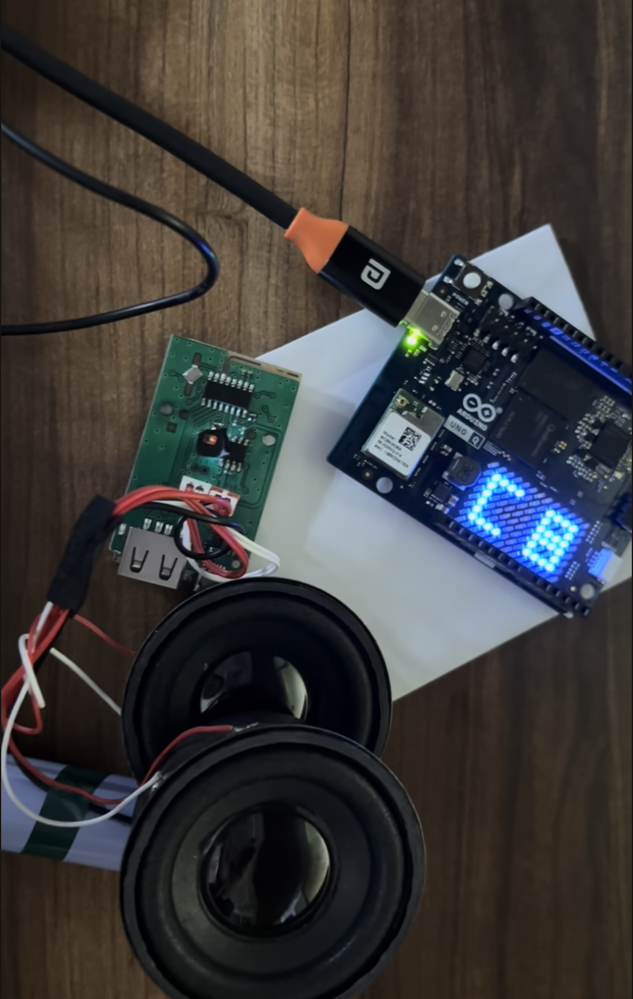

# Commbox Cricket Assistant
This application is a real-time, bidirectional AI voice assistant specifically made for natural cricket oriented conversations with amateurs and professionals alike. It integrates high-fidelity voice interaction with the UNO Q's on-board LED matrix that visualizes the audio spectrum of the AI's response in real-time ofr more natural interaction.

## Features

*   **Bidirectional Voice AI:** Enables fluid, interruptible conversations using Audio Native Model via WebSocket.
*   **Real-Time Visualization:** Performs onboard FFT (Fast Fourier Transform) analysis on audio streams to generate a 13-band frequency spectrum.
*   **Hardware Integration:** Drives the on-board LED matrix via Serial UART for low-latency visual feedback.
*   **Agent Mode:** Visualizes the AI's speech during a conversation.
